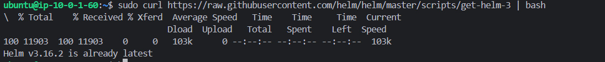
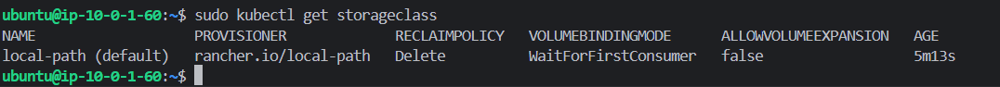
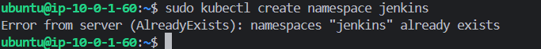
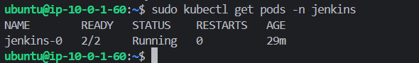
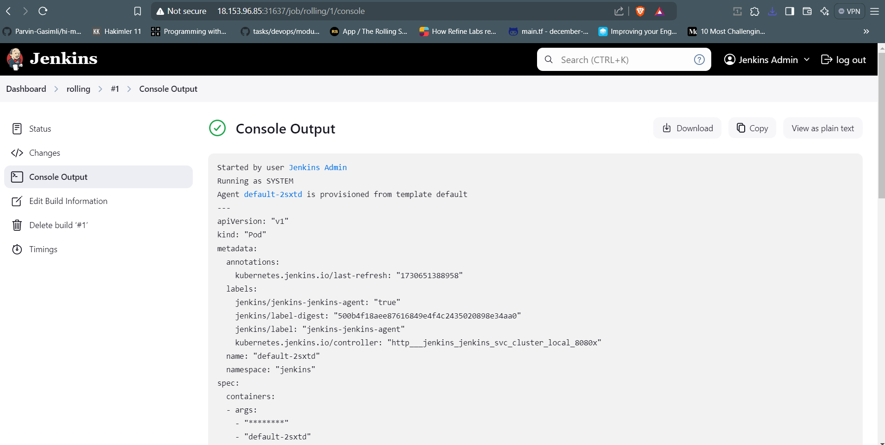

# Installing Jenkins on Kubernetes

This guide walks through the process of installing Jenkins on a Kubernetes cluster using Helm.

## Prerequisites

- A running Kubernetes cluster
- kubectl installed and configured
- Helm package manager

## 1. Install Helm

First, install Helm by following the [official Helm installation guide](https://helm.sh/docs/intro/install/).

Verify your Helm installation with these test commands:
```bash
helm repo add bitnami https://charts.bitnami.com/bitnami
helm install my-nginx bitnami/nginx
helm uninstall my-nginx
```


## 2. Prepare the Cluster

Ensure your Kubernetes cluster can handle persistent storage:

- Verify that your cluster supports Persistent Volumes (PV) and Persistent Volume Claims (PVC)
- If using k3s, the local-path provisioner is typically pre-configured


## 3. Install Jenkins

### Create a Dedicated Namespace

```bash
kubectl create namespace jenkins
```


### Deploy Jenkins Using Helm

Install Jenkins with basic configuration:
```bash
helm install jenkins bitnami/jenkins \
  --namespace jenkins \
  --set service.type=NodePort
```

**Note:** Additional configuration options:
- Use `--set` flags for individual settings
- Or create a `values.yaml` file for more complex configurations

## 4. Verify Installation

### Check Pod Status

```bash
kubectl get pods -n jenkins
```


### Troubleshooting

If pods aren't running, check the logs:
```bash
kubectl logs <jenkins-pod-name> -n jenkins
```

## 5. Access Jenkins UI

1. Get the assigned NodePort:
```bash
kubectl get svc jenkins -n jenkins
```

2. Access Jenkins web interface:
   - URL format: `http://<NodeIP>:<NodePort>`
   - Replace `<NodeIP>` with your node's IP address
   - Replace `<NodePort>` with the port number from the previous command

## 6. Create Your First Project

1. Log into Jenkins using your credentials
2. Click "New Item"
3. Select "Freestyle project"
4. In the Build section, add a Shell build step:
```bash
echo "Hello World"
```

[text](hello-world.txt)

## Troubleshooting Tips

- If pods are stuck in `Pending` state, check your cluster's resources
- For permission issues, verify RBAC settings
- For storage issues, confirm PV/PVC configuration

