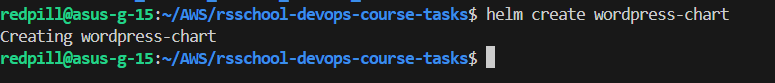
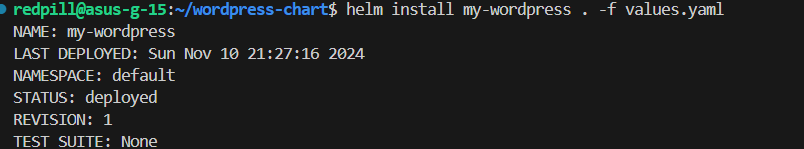
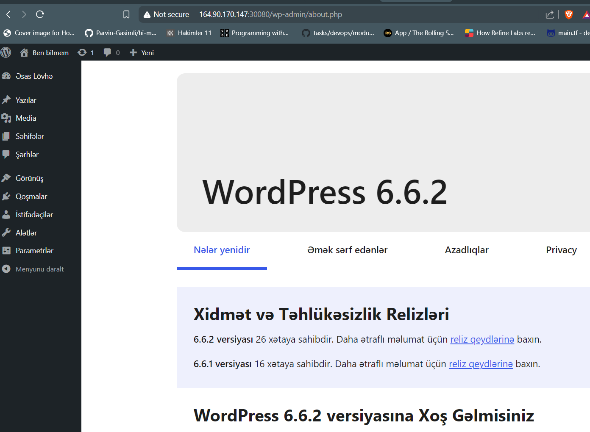
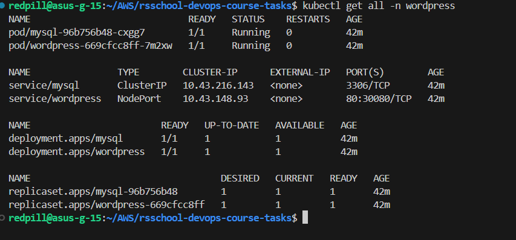

1. **Create Helm Chart**

   

2. **Deploy the Application**

   - Deploy the WordPress application using the Helm chart.
   
   - Ensure the application is accessible from the internet.
   

3. **Store Artifacts in Git**

   - Store the WordPress application and Helm chart in a new git repository.
   [Wordpress app on Github](https://github.com/dadashussein/wordpress-chart)

4. **Verify the Application**

   - Verify that the application is running and accessible.
   

5. **Additional Tasks**
   - Implement a CI/CD pipeline to automate the deployment of the WordPress.
   - Document the application setup and deployment process in a README file.